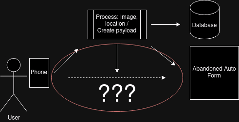

# A Better Abandoned Auto Intake Form
Goal:  Automate the PBOT [Abandoned Auto intake form](https://www.portland.gov/transportation/parking/abandoned-auto) so it is easier to report cars that fit the "abandoned" definition, including: expired license plate tags, no license plates, inoperable vehicles, and more.

## Desired Capabilities
- Predict vehicle info with a single photo: vehicle type, make, color, license plate (state and alphanumeric)
- Automatically populate location (either geotag on photo or direct browser location)
- Pre-populate repeated/standard form elements per user (save per user device)

## Additional Features
- Record all submissions (non-PII fields) to database to collect and do downstream analysis
- Integrate https://safelanes.org/ capabilities
- Capture and Report other traffic violations

# Proposed Flow


# Project Background
**Problem**:  I want to report cars with expired/invalid/no plates, and after a recent call with a Parking Enforcement representative (503-823-5195, option 4). The agent told me to report any expired tags to the abandoned auto form--even if the vehicle is driven daily and not actually "abandoned".  In fact, if the vehicle moves, the agent said to just submit another form to "help them find the car".  Now, there are so many cars in my neighborhood with expired registration, that I cannot spend the 5-10 minutes per car submitting the form, especially as they move (as an example, I walked 2 square blocks and have literally 12 cars to report).

**Opportunity**:  PBOT recently redesigned their Abandoned Auto intake form: it's no longer behind a login and it's slightly shorter.  I want to more-automatically collect, inject, and submit the form with the required information.  I have a server running https://platerecognizer.com/, so we can submit pics and let machine learning predict the Vehicle Info: vehicle type, make, color, and license plate (if exists). Then POST all that info in-lieu of the intake form.

**Request**: I need help designing and then developing the apps/script(s) to either inject the info to the form or take the correct form submission "hand-shake" and submit it more automatically.  If you know of libraries, scripts, or would be willing to help me design this as an open source project, I would be very appreciative.  I am not familiar with tapping into forms to automate this kind of submission, so I could use any guidance you can send my way.  I can build the photo submission and return the payloads, help coordinate the work, etc.

# Technical details

## Form HTML

```
<form
    class="webform-submission-form webform-submission-add-form webform-submission-report-abandoned-vehicle-form webform-submission-report-abandoned-vehicle-add-form webform-submission-report-abandoned-vehicle-node-258-form webform-submission-report-abandoned-vehicle-node-258-add-form js-webform-details-toggle webform-details-toggle antibot"
    data-drupal-selector="webform-submission-report-abandoned-vehicle-node-258-add-form" novalidate=""
    enctype="multipart/form-data" data-action="/transportation/parking/abandoned-auto"
    action="/transportation/parking/abandoned-auto" method="post"
    id="webform-submission-report-abandoned-vehicle-node-258-add-form" accept-charset="UTF-8"
    data-once="form-updated webform-details-toggle webform-auto-file-upload"
    data-drupal-form-fields="edit-report-is-camp-yes,edit-report-is-camp-no,edit-report-vehicle-inoperable-missing-parts-or-damage,edit-report-vehicle-inoperable-expired-or-missing-registration,edit-report-vehicle-inoperable-prohibited-vehicle,edit-report-vehicle-inoperable-fire-damage,edit-report-vehicle-inoperable-none,edit-report-location-is-private-yes,edit-report-location-is-private-no,edit-report-location-is-private-not-sure,location_search,location_address,location_types,location_type_taxlot,location_type_park,location_type_waterbody,location_type_trail,location_type_stream,location_type_street,location_type_row,location_lat,location_lon,location_x,location_y,location_details,location_attributes,location_zipcode,edit-report-vehicle-items-0-item-type,edit-report-vehicle-items-0-item-make,edit-report-vehicle-items-0-item-color,edit-report-vehicle-items-0-item-license-plate-state,edit-report-vehicle-items-0-item-license-plate-number,edit-report-photo-upload,edit-report-photo-upload-button,edit-contact-name,edit-contact-phone,edit-contact-email,edit-confidentiality-waiver-i-do-not-waive-confidentiality,edit-confidentiality-waiver-i-waive-confidentiality,edit-actions-submit,edit-link">
    <noscript>
        <div class="antibot-no-js antibot-message antibot-message-warning">You must have JavaScript enabled to use this
            form.</div>
    </noscript>
    <div class="webform-required" aria-hidden="true"><span class="form-required"></span>Indicates required field
    </div>
    <div data-drupal-selector="edit-container-intro" id="edit-container-intro" class="js-form-wrapper form-wrapper">
        <div id="edit-introductory-text"
            class="js-form-item form-item js-form-type-webform-markup form-item-introductory-text js-form-item-introductory-text form-no-label">
            <p>If this is a life-threatening emergency or to report a crime in progress, call 9-1-1.</p>
        </div>
    </div>
    <section data-drupal-selector="edit-section-report" id="edit-section-report"
        class="js-form-item form-item js-form-wrapper form-wrapper webform-section">
        <h2 class="visually-hidden webform-section-title">Report</h2>
        <div class="webform-section-wrapper">
            <fieldset data-drupal-selector="edit-report-is-camp" id="edit-report-is-camp--wrapper"
                class="radios--wrapper fieldgroup form-composite webform-composite-visible-title required js-webform-type-radios webform-type-radios js-form-item form-item js-form-wrapper form-wrapper"
                data-once="webform-radios-required">
                <legend id="edit-report-is-camp--wrapper-legend"><span
                        class="fieldset-legend js-form-required form-required">Is someone living in the vehicle or is it
                        part of an encampment?</span></legend>
                <div class="fieldset-wrapper">
                    <div id="edit-report-is-camp"
                        class="js-webform-radios webform-options-display-one-column form-radios">
                        <div
                            class="js-form-item form-item js-form-type-radio form-item-report-is-camp js-form-item-report-is-camp form-check">
                            <div class="form-element-container"><input data-drupal-selector="edit-report-is-camp-yes"
                                    type="radio" id="edit-report-is-camp-yes" name="report_is_camp" value="Yes"
                                    class="form-radio form-check-input" required="required"><label
                                    for="edit-report-is-camp-yes" class="option">Yes</label></div>
                        </div>
                        <div
                            class="js-form-item form-item js-form-type-radio form-item-report-is-camp js-form-item-report-is-camp form-check">
                            <div class="form-element-container"><input data-drupal-selector="edit-report-is-camp-no"
                                    type="radio" id="edit-report-is-camp-no" name="report_is_camp" value="No"
                                    class="form-radio form-check-input" required="required"><label
                                    for="edit-report-is-camp-no" class="option">No</label></div>
                        </div>
                    </div>
                </div>
            </fieldset>
            <div class="js-webform-states-hidden js-form-wrapper"
                data-drupal-states="{&quot;visible&quot;:{&quot;.webform-submission-report-abandoned-vehicle-node-258-add-form :input[name=\u0022report_is_camp\u0022]&quot;:{&quot;value&quot;:&quot;Yes&quot;}}}"
                style="display: none;">
                <div class="js-form-item form-item js-form-type-webform-markup form-item-markup-campsite-stop js-form-item-markup-campsite-stop form-no-label"
                    id="edit-markup-campsite-stop">
                    <p><a class="btn btn-primary" href="/homelessnessimpactreduction/report-campsite">Continue to report
                            a campsite</a></p>
                </div>
            </div>
            <fieldset data-drupal-selector="edit-report-vehicle-inoperable" data-options-none="none"
                class="js-webform-states-hidden checkboxes--wrapper fieldgroup form-composite webform-composite-visible-title js-webform-type-checkboxes webform-type-checkboxes js-form-item form-item js-form-wrapper form-wrapper required"
                id="edit-report-vehicle-inoperable--wrapper"
                data-drupal-states="{&quot;visible&quot;:{&quot;.webform-submission-report-abandoned-vehicle-node-258-add-form :input[name=\u0022report_is_camp\u0022]&quot;:{&quot;value&quot;:&quot;No&quot;}},&quot;required&quot;:{&quot;.webform-submission-report-abandoned-vehicle-node-258-add-form :input[name=\u0022report_is_camp\u0022]&quot;:{&quot;value&quot;:&quot;No&quot;}}}"
                style="display: block;" data-once="webform-checkboxes-all-or-none">
                <legend><span class="fieldset-legend js-form-required form-required">Which of the following describes
                        the vehicle you are reporting?</span></legend>
                <div class="fieldset-wrapper">
                    <div id="edit-report-vehicle-inoperable"
                        class="js-webform-checkboxes webform-options-display-one-column form-checkboxes">
                        <div
                            class="js-form-item form-item js-form-type-checkbox form-item-report-vehicle-inoperable-missing-parts-or-damage js-form-item-report-vehicle-inoperable-missing-parts-or-damage form-check">
                            <div class="form-element-container"><input
                                    data-drupal-selector="edit-report-vehicle-inoperable-missing-parts-or-damage"
                                    type="checkbox" id="edit-report-vehicle-inoperable-missing-parts-or-damage"
                                    name="report_vehicle_inoperable[Missing parts or damage]"
                                    value="Missing parts or damage" class="form-checkbox form-check-input"
                                    required="required"><label
                                    for="edit-report-vehicle-inoperable-missing-parts-or-damage" class="option">Missing
                                    parts or other damage that makes the vehicle appear
                                    <strong>inoperable</strong></label></div>
                        </div>
                        <div
                            class="js-form-item form-item js-form-type-checkbox form-item-report-vehicle-inoperable-expired-or-missing-registration js-form-item-report-vehicle-inoperable-expired-or-missing-registration form-check">
                            <div class="form-element-container"><input
                                    data-drupal-selector="edit-report-vehicle-inoperable-expired-or-missing-registration"
                                    type="checkbox" id="edit-report-vehicle-inoperable-expired-or-missing-registration"
                                    name="report_vehicle_inoperable[Expired or missing registration]"
                                    value="Expired or missing registration"
                                    class="form-checkbox form-check-input"><label
                                    for="edit-report-vehicle-inoperable-expired-or-missing-registration"
                                    class="option">Displaying <strong>expired/missing</strong> registration</label>
                            </div>
                        </div>
                        <div
                            class="js-form-item form-item js-form-type-checkbox form-item-report-vehicle-inoperable-prohibited-vehicle js-form-item-report-vehicle-inoperable-prohibited-vehicle form-check">
                            <div class="form-element-container"><input
                                    data-drupal-selector="edit-report-vehicle-inoperable-prohibited-vehicle"
                                    type="checkbox" id="edit-report-vehicle-inoperable-prohibited-vehicle"
                                    name="report_vehicle_inoperable[Prohibited vehicle]" value="Prohibited vehicle"
                                    class="form-checkbox form-check-input"><label
                                    for="edit-report-vehicle-inoperable-prohibited-vehicle" class="option">A prohibited
                                    container, boat, trailer, travel trailer, drop box, storage container, motorhome or
                                    RV</label></div>
                        </div>
                        <div
                            class="js-form-item form-item js-form-type-checkbox form-item-report-vehicle-inoperable-fire-damage js-form-item-report-vehicle-inoperable-fire-damage form-check">
                            <div class="form-element-container"><input
                                    data-drupal-selector="edit-report-vehicle-inoperable-fire-damage" type="checkbox"
                                    id="edit-report-vehicle-inoperable-fire-damage"
                                    name="report_vehicle_inoperable[Fire damage]" value="Fire damage"
                                    class="form-checkbox form-check-input"><label
                                    for="edit-report-vehicle-inoperable-fire-damage" class="option">Severely damaged by
                                    <strong>fire</strong></label></div>
                        </div>
                        <div
                            class="js-form-item form-item js-form-type-checkbox form-item-report-vehicle-inoperable-none js-form-item-report-vehicle-inoperable-none form-check">
                            <div class="form-element-container"><input
                                    data-drupal-selector="edit-report-vehicle-inoperable-none" type="checkbox"
                                    id="edit-report-vehicle-inoperable-none" name="report_vehicle_inoperable[none]"
                                    value="none" class="form-checkbox form-check-input"><label
                                    for="edit-report-vehicle-inoperable-none" class="option">None of the above</label>
                            </div>
                        </div>
                    </div>
                </div>
            </fieldset>
            <div class="js-webform-states-hidden js-form-wrapper form-wrapper"
                data-drupal-selector="edit-container-not-inoperable"
                data-drupal-states="{&quot;visible&quot;:{&quot;.webform-submission-report-abandoned-vehicle-node-258-add-form :input[name=\u0022report_vehicle_inoperable[none]\u0022]&quot;:{&quot;checked&quot;:true}}}"
                id="edit-container-not-inoperable" style="display: none;">
                <div id="edit-report-need-more-info-text-stop"
                    class="js-form-item form-item js-form-type-webform-markup form-item-report-need-more-info-text-stop js-form-item-report-need-more-info-text-stop form-no-label">
                    <div class="alert alert--info next-steps">
                        <h2>Next Steps</h2>
                        <p>For a vehicle to be considered abandoned or junk, it must meet one of the criteria listed
                            above.</p>
                        <p>The following are not considered an abandoned or junk vehicle under our current operating
                            conditions:</p>
                        <ul>
                            <li>An unfamiliar vehicle parked in front of your property and/or has not moved for several
                                days</li>
                            <li>A vehicle with no front license plate</li>
                            <li>A vehicle double-parked, blocking a roadway, or blocking a driveway. <strong>Please
                                    report these violations to Parking Enforcement at <a
                                        href="tel:+1-503-823-5195">503-823-5195</a></strong></li>
                        </ul>
                        <p><strong>Note:</strong> To report a suspicious vehicle parked in your neighborhood (for
                            example, a vehicle you suspect to have been stolen), call the Police Non-Emergency Line at
                            <a href="tel:+1-503-823-3333">503-823-3333</a>.</p>
                    </div>
                </div>
            </div>
            <div class="js-webform-states-hidden js-form-wrapper form-wrapper"
                data-drupal-selector="edit-container-inoperable"
                data-drupal-states="{&quot;visible&quot;:[{&quot;.webform-submission-report-abandoned-vehicle-node-258-add-form :input[name=\u0022report_vehicle_inoperable[Missing parts or damage]\u0022]&quot;:{&quot;checked&quot;:true}},&quot;or&quot;,{&quot;.webform-submission-report-abandoned-vehicle-node-258-add-form :input[name=\u0022report_vehicle_inoperable[Expired or missing registration]\u0022]&quot;:{&quot;checked&quot;:true}},&quot;or&quot;,{&quot;.webform-submission-report-abandoned-vehicle-node-258-add-form :input[name=\u0022report_vehicle_inoperable[Prohibited vehicle]\u0022]&quot;:{&quot;checked&quot;:true}},&quot;or&quot;,{&quot;.webform-submission-report-abandoned-vehicle-node-258-add-form :input[name=\u0022report_vehicle_inoperable[Fire damage]\u0022]&quot;:{&quot;checked&quot;:true}}]}"
                id="edit-container-inoperable" style="display: none;">
                <section data-drupal-selector="edit-container-location" id="edit-container-location"
                    class="js-form-item form-item js-form-wrapper form-wrapper webform-section">
                    <h2 class="webform-section-title">Vehicle location</h2>
                    <div class="webform-section-wrapper">
                        <fieldset data-drupal-selector="edit-report-location-is-private"
                            class="webform-has-field-prefix radios--wrapper fieldgroup form-composite webform-composite-visible-title js-webform-type-radios webform-type-radios js-form-item form-item js-form-wrapper form-wrapper"
                            id="edit-report-location-is-private--wrapper"
                            data-drupal-states="{&quot;required&quot;:[{&quot;.webform-submission-report-abandoned-vehicle-node-258-add-form :input[name=\u0022report_vehicle_inoperable[Missing parts or damage]\u0022]&quot;:{&quot;checked&quot;:true}},&quot;or&quot;,{&quot;.webform-submission-report-abandoned-vehicle-node-258-add-form :input[name=\u0022report_vehicle_inoperable[Expired or missing registration]\u0022]&quot;:{&quot;checked&quot;:true}},&quot;or&quot;,{&quot;.webform-submission-report-abandoned-vehicle-node-258-add-form :input[name=\u0022report_vehicle_inoperable[Prohibited vehicle]\u0022]&quot;:{&quot;checked&quot;:true}},&quot;or&quot;,{&quot;.webform-submission-report-abandoned-vehicle-node-258-add-form :input[name=\u0022report_vehicle_inoperable[Fire damage]\u0022]&quot;:{&quot;checked&quot;:true}}]}"
                            data-once="webform-radios-required">
                            <legend id="edit-report-location-is-private--wrapper-legend"><span
                                    class="fieldset-legend">Is the location on private property?</span></legend>
                            <div class="fieldset-wrapper"><span class="field-prefix">
                                    <div class="description">
                                        <p>Such as a home, apartment building, business, church, etc.</p>
                                    </div>
                                </span>
                                <div id="edit-report-location-is-private"
                                    class="js-webform-radios webform-options-display-side-by-side form-radios">
                                    <div
                                        class="js-form-item form-item js-form-type-radio form-item-report-location-is-private js-form-item-report-location-is-private form-check">
                                        <div class="form-element-container"><input
                                                data-drupal-selector="edit-report-location-is-private-yes" type="radio"
                                                id="edit-report-location-is-private-yes"
                                                name="report_location_is_private" value="Yes"
                                                class="form-radio form-check-input"><label
                                                for="edit-report-location-is-private-yes" class="option">Yes</label>
                                        </div>
                                    </div>
                                    <div
                                        class="js-form-item form-item js-form-type-radio form-item-report-location-is-private js-form-item-report-location-is-private form-check">
                                        <div class="form-element-container"><input
                                                data-drupal-selector="edit-report-location-is-private-no" type="radio"
                                                id="edit-report-location-is-private-no"
                                                name="report_location_is_private" value="No"
                                                class="form-radio form-check-input"><label
                                                for="edit-report-location-is-private-no" class="option">No</label></div>
                                    </div>
                                    <div
                                        class="js-form-item form-item js-form-type-radio form-item-report-location-is-private js-form-item-report-location-is-private form-check">
                                        <div class="form-element-container"><input
                                                data-drupal-selector="edit-report-location-is-private-not-sure"
                                                type="radio" id="edit-report-location-is-private-not-sure"
                                                name="report_location_is_private" value="Not sure"
                                                class="form-radio form-check-input"><label
                                                for="edit-report-location-is-private-not-sure" class="option">Not
                                                sure</label></div>
                                    </div>
                                </div>
                            </div>
                        </fieldset>
                        <div class="js-webform-states-hidden js-form-wrapper"
                            data-drupal-states="{&quot;visible&quot;:{&quot;.webform-submission-report-abandoned-vehicle-node-258-add-form :input[name=\u0022report_location_is_private\u0022]&quot;:{&quot;value&quot;:&quot;Yes&quot;}}}"
                            style="display: none;">
                            <div class="js-form-item form-item js-form-type-webform-markup form-item-markup-private-property-stop js-form-item-markup-private-property-stop form-no-label"
                                id="edit-markup-private-property-stop">
                                <div class="alert alert--info next-steps">
                                    <h2>Next Steps</h2>
                                    <p><strong>Abandoned vehicles on private property:</strong> You are reporting a
                                        potential code violation. You may want to first try talking to the property
                                        owner to see if the issue can be resolved. If not, please fill out the Bureau of
                                        Development Service's online <a
                                            href="/bds/code-enforcement/report-code-violation">violation reporting
                                            form</a>, or call the Code Enforcement Line at <a
                                            href="tel:+1-503-823-2633">503-823-2633</a> to report your concern.</p>
                                    <p><strong>For property owners:</strong> You are responsible for addressing concerns
                                        on your property. If you would like additional information, please call <a
                                            href="tel:311">3-1-1</a> or <a href="tel:+15038234000">503-823-4000</a> so
                                        staff can assist you further.</p>
                                </div>
                            </div>
                        </div>
                        <div class="js-webform-states-hidden js-form-wrapper"
                            data-drupal-states="{&quot;invisible&quot;:{&quot;.webform-submission-report-abandoned-vehicle-node-258-add-form :input[name=\u0022report_location_is_private\u0022]&quot;:{&quot;value&quot;:&quot;Yes&quot;}}}"
                            style="display: block;">
                            <fieldset data-drupal-selector="edit-report-location"
                                class="portland-location-picker--wrapper fieldgroup form-composite webform-composite-hidden-title js-webform-type-portland-location-picker webform-type-portland-location-picker js-form-item form-item js-form-wrapper form-wrapper"
                                id="edit-report-location--wrapper" data-once="location_picker">
                                <legend><span class="visually-hidden fieldset-legend">Location</span></legend>
                                <div class="fieldset-wrapper">
                                    <div
                                        class="js-form-item form-item js-form-type-textfield form-item-report-location-location-search js-form-item-report-location-location-search">
                                        <label for="location_search">Location Search</label><span class="description">
                                            <div id="location_search--description" class="webform-element-description">
                                                Search the map for an address, cross streets, park, or community center.
                                                Or use the map to click a location.</div>
                                        </span><input
                                            class="location-picker-address form-text form-control ui-autocomplete-input"
                                            autocomplete="off" data-drupal-selector="location-search"
                                            aria-describedby="location_search--description" type="text"
                                            id="location_search" name="report_location[location_search]" value=""
                                            size="60" maxlength="255"><input
                                            class="button button--primary location-verify js-form-submit form-submit"
                                            type="button" id="location_verify" name="op" value="Search"></div>
                                    <div id="edit-report-location-precision-text"
                                        class="js-form-item form-item js-form-type-markup form-item- js-form-item- form-no-label">
                                        <label for="edit-report-location-precision-text"
                                            class="visually-hidden">Precision</label>
                                        <div class="alert alert--info next-steps visually-hidden precision_text"
                                            aria-hidden="true" id="precision_text"><strong>IMPORTANT:</strong> To help
                                            us provide better service, please click, tap, or drag the marker to the
                                            precise location on the map.</div>
                                    </div>
                                    <div id="location_map"
                                        class="js-form-item form-item js-form-type-markup form-item- js-form-item- form-no-label">
                                        <label for="location_map" class="visually-hidden">Location map</label>
                                        <div id="location_map_container"
                                            class="location-map leaflet-container leaflet-touch leaflet-fade-anim leaflet-touch-zoom"
                                            tabindex="0"
                                            data-gesture-handling-touch-content="Use two fingers to move the map"
                                            data-gesture-handling-scroll-content="Use ctrl + scroll to zoom the map"
                                            style="position: relative; cursor: crosshair;">
                                            <div class="leaflet-pane leaflet-map-pane"
                                                style="transform: translate3d(0px, 0px, 0px);">
                                                <div class="leaflet-pane leaflet-tile-pane">
                                                    <div class="leaflet-layer " style="z-index: 1; opacity: 1;">
                                                        <div class="leaflet-tile-container leaflet-zoom-animated"
                                                            style="z-index: 18; transform: translate3d(0px, 0px, 0px) scale(1);">
                                                            
                                                        </div>
                                                    </div>
                                                </div>
                                                <div class="leaflet-pane leaflet-overlay-pane"><svg
                                                        pointer-events="none" class="leaflet-zoom-animated" width="0"
                                                        height="0" viewBox="0 0 0 0"
                                                        style="transform: translate3d(0px, 0px, 0px);">
                                                        <g>
                                                            <path stroke="red" stroke-opacity="1" stroke-width="1"
                                                                stroke-linecap="round" stroke-linejoin="round"
                                                                stroke-dasharray="2 4" fill="red" fill-opacity="0"
                                                                fill-rule="evenodd" d="M1 1L1 -1L-1 -1L-1 1z"></path>
                                                        </g>
                                                    </svg></div>
                                                <div class="leaflet-pane leaflet-shadow-pane"></div>
                                                <div class="leaflet-pane leaflet-marker-pane"></div>
                                                <div class="leaflet-pane leaflet-tooltip-pane"></div>
                                                <div class="leaflet-pane leaflet-popup-pane"></div>
                                                <div class="leaflet-proxy leaflet-zoom-animated"></div>
                                            </div>
                                            <div class="leaflet-control-container">
                                                <div class="leaflet-top leaflet-left"></div>
                                                <div class="leaflet-top leaflet-right">
                                                    <div class="leaflet-control-zoom leaflet-bar leaflet-control"><a
                                                            class="leaflet-control-zoom-in" href="#" title="Zoom in"
                                                            role="button" aria-label="Zoom in"
                                                            aria-disabled="false"><span
                                                                aria-hidden="true">+</span></a><a
                                                            class="leaflet-control-zoom-out" href="#" title="Zoom out"
                                                            role="button" aria-label="Zoom out"
                                                            aria-disabled="false"><span aria-hidden="true">−</span></a>
                                                    </div>
                                                </div>
                                                <div class="leaflet-bottom leaflet-left"></div>
                                                <div class="leaflet-bottom leaflet-right">
                                                    <div class="leaflet-bar locate-control leaflet-control leaflet-control-custom"
                                                        title="Locate Me"
                                                        style="background-image: url(&quot;/modules/custom/portland/modules/portland_location_picker/images/map_locate.png&quot;);">
                                                    </div>
                                                    <div class="leaflet-bar locate-control leaflet-control leaflet-control-custom"
                                                        title="Aerial view"
                                                        style="background-image: url(&quot;/modules/custom/portland/modules/portland_location_picker/images/map_aerial.png&quot;);">
                                                    </div>
                                                    <div class="leaflet-control-attribution leaflet-control"><a
                                                            href="https://leafletjs.com"
                                                            title="A JavaScript library for interactive maps"><svg
                                                                aria-hidden="true" xmlns="http://www.w3.org/2000/svg"
                                                                width="12" height="8" viewBox="0 0 12 8"
                                                                class="leaflet-attribution-flag">
                                                                <path fill="#4C7BE1" d="M0 0h12v4H0z"></path>
                                                                <path fill="#FFD500" d="M0 4h12v3H0z"></path>
                                                                <path fill="#E0BC00" d="M0 7h12v1H0z"></path>
                                                            </svg> Leaflet</a> <span aria-hidden="true">|</span>
                                                        PortlandMaps ESRI</div>
                                                </div>
                                            </div>
                                        </div>
                                        <div class="loader-container" role="status">
                                            <div class="loader"></div>
                                            <div class="visually-hidden">Loading...</div>
                                        </div>
                                    </div>
                                    <div id="edit-report-location-suggestions-modal"
                                        class="js-form-item form-item js-form-type-markup form-item- js-form-item- form-no-label">
                                        <label for="edit-report-location-suggestions-modal"
                                            class="visually-hidden">Suggestions</label>
                                        <div id="suggestions_modal" class="visually-hidden"></div>
                                    </div>
                                    <div id="edit-report-location-status-modal"
                                        class="js-form-item form-item js-form-type-markup form-item- js-form-item- form-no-label">
                                        <label for="edit-report-location-status-modal" class="visually-hidden">Status
                                            indicator</label>
                                        <div id="status_modal" class="visually-hidden"></div>
                                    </div><input class="location-picker-address form-control" autocomplete="off"
                                        id="location_address"
                                        data-drupal-selector="edit-report-location-location-address" type="hidden"
                                        name="report_location[location_address]" value=""
                                        data-drupal-states="{&quot;optional&quot;:{&quot;.webform-submission-report-abandoned-vehicle-node-258-add-form :input[name=\u0022report_location_is_private\u0022]&quot;:{&quot;value&quot;:&quot;Yes&quot;}}}"
                                        required="required" aria-required="true"><input id="location_types"
                                        data-drupal-selector="edit-report-location-location-types" type="hidden"
                                        name="report_location[location_types]" value="" class="form-control"><input
                                        id="location_type_taxlot"
                                        data-drupal-selector="edit-report-location-location-type-taxlot" type="hidden"
                                        name="report_location[location_type_taxlot]" value=""
                                        class="form-control"><input id="location_type_park"
                                        data-drupal-selector="edit-report-location-location-type-park" type="hidden"
                                        name="report_location[location_type_park]" value="" class="form-control"><input
                                        id="location_type_waterbody"
                                        data-drupal-selector="edit-report-location-location-type-waterbody"
                                        type="hidden" name="report_location[location_type_waterbody]" value=""
                                        class="form-control"><input id="location_type_trail"
                                        data-drupal-selector="edit-report-location-location-type-trail" type="hidden"
                                        name="report_location[location_type_trail]" value="" class="form-control"><input
                                        id="location_type_stream"
                                        data-drupal-selector="edit-report-location-location-type-stream" type="hidden"
                                        name="report_location[location_type_stream]" value=""
                                        class="form-control"><input id="location_type_street"
                                        data-drupal-selector="edit-report-location-location-type-street" type="hidden"
                                        name="report_location[location_type_street]" value=""
                                        class="form-control"><input id="location_type_row"
                                        data-drupal-selector="edit-report-location-location-type-row" type="hidden"
                                        name="report_location[location_type_row]" value="" class="form-control"><input
                                        class="location-lat form-control" id="location_lat"
                                        data-webform-required-error="Location is required. Please select a location by searching or clicking the map."
                                        data-drupal-selector="edit-report-location-location-lat" type="hidden"
                                        name="report_location[location_lat]" value=""
                                        data-drupal-states="{&quot;optional&quot;:{&quot;.webform-submission-report-abandoned-vehicle-node-258-add-form :input[name=\u0022report_location_is_private\u0022]&quot;:{&quot;value&quot;:&quot;Yes&quot;}}}"
                                        required="required" aria-required="true"
                                        data-once="webform-required-error"><input class="location-lng form-control"
                                        id="location_lon" data-drupal-selector="edit-report-location-location-lon"
                                        type="hidden" name="report_location[location_lon]" value=""><input
                                        class="location-x form-control" id="location_x"
                                        data-drupal-selector="edit-report-location-location-x" type="hidden"
                                        name="report_location[location_x]" value=""><input
                                        class="location-y form-control" id="location_y"
                                        data-drupal-selector="edit-report-location-location-y" type="hidden"
                                        name="report_location[location_y]" value="">
                                    <div
                                        class="js-form-item form-item js-form-type-textfield form-item-report-location-location-details js-form-item-report-location-location-details">
                                        <label for="location_details">Location Details (optional)</label><span
                                            class="description">
                                            <div id="location_details--description" class="webform-element-description">
                                                Please provide any other details that might help us locate the vehicle
                                                you are reporting.</div>
                                        </span><input
                                            class="location-details js-webform-counter webform-counter form-text form-control"
                                            autocomplete="off" data-counter-type="character" data-counter-maximum="400"
                                            data-drupal-selector="location-details"
                                            aria-describedby="location_details--description" type="text"
                                            id="location_details" name="report_location[location_details]" value=""
                                            size="60" maxlength="400" data-once="webform-counter">
                                        <div class="text-count-wrapper">
                                            <div class="text-count-message" aria-live="polite" aria-atomic="true"
                                                style="display: inline;"><span class="text-count">400</span>
                                                character(s) remaining</div>
                                            <div class="text-count-overflow-wrapper" style="display: none;"></div>
                                        </div>
                                    </div><input class="location-attributes form-control" id="location_attributes"
                                        data-drupal-selector="edit-report-location-location-attributes" type="hidden"
                                        name="report_location[location_attributes]" value=""><input
                                        id="location_zipcode"
                                        data-drupal-selector="edit-report-location-location-zipcode" type="hidden"
                                        name="report_location[location_zipcode]" value="" class="form-control">
                                </div>
                            </fieldset>
                        </div>
                    </div>
                </section>
                <section
                    class="js-webform-states-hidden js-form-item form-item js-form-wrapper form-wrapper webform-section"
                    data-drupal-selector="edit-container-abandoned-auto"
                    data-drupal-states="{&quot;invisible&quot;:{&quot;.webform-submission-report-abandoned-vehicle-node-258-add-form :input[name=\u0022report_location_is_private\u0022]&quot;:{&quot;value&quot;:&quot;Yes&quot;}}}"
                    id="edit-container-abandoned-auto" style="display: block;">
                    <h2 class="webform-section-title">Vehicle info</h2>
                    <div class="webform-section-wrapper">
                        <div id="edit-markup-vehicle-info"
                            class="js-form-item form-item js-form-type-webform-markup form-item-markup-vehicle-info js-form-item-markup-vehicle-info form-no-label">
                            <p>Please provide as many details as possible about the abandoned vehicle if it seems safe
                                to do so.</p>
                        </div>
                        <div id="report_vehicle_table">
                            <div id="edit-report-vehicle"
                                class="js-form-item form-item js-form-type-webform-custom-composite form-item-report-vehicle js-form-item-report-vehicle form-no-label">
                                <div class="webform-multiple-table webform-multiple-table-responsive">
                                    <div class="tableresponsive-toggle-columns"><button type="button"
                                            class="link tableresponsive-toggle"
                                            title="Show table cells that were hidden to make the table fit within a small screen."
                                            style="display: none;">Hide lower priority columns</button></div>
                                    <table data-drupal-selector="edit-report-vehicle-items"
                                        id="edit-report-vehicle-items" class="responsive-enabled" data-striping="1"
                                        data-once="tableresponsive">
                                        <thead>
                                            <tr>
                                                <th colspan="1"><span class="visually-hidden">Vehicle</span></th>
                                            </tr>
                                        </thead>
                                        <tbody>
                                            <tr data-drupal-selector="edit-report-vehicle-items-0" class="odd">
                                                <td>
                                                    <div
                                                        class="js-form-item form-item js-form-type-select form-item-report-vehicle-items-0--item--type js-form-item-report-vehicle-items-0--item--type">
                                                        <label for="edit-report-vehicle-items-0-item-type"
                                                            class="js-form-required form-required">Vehicle
                                                            type</label><select
                                                            data-drupal-selector="edit-report-vehicle-items-0-item-type"
                                                            id="edit-report-vehicle-items-0-item-type"
                                                            name="report_vehicle[items][0][_item_][type]"
                                                            class="form-select"
                                                            data-drupal-states="{&quot;optional&quot;:{&quot;.webform-submission-report-abandoned-vehicle-node-258-add-form :input[name=\u0022report_location_is_private\u0022]&quot;:{&quot;value&quot;:&quot;Yes&quot;}}}"
                                                            required="required" aria-required="true">
                                                            <option value="" selected="selected">- None -</option>
                                                            <option value="2 DOOR">2 Door</option>
                                                            <option value="4 DOOR">4 Door</option>
                                                            <option value="5TH WHEEL">5th Wheel</option>
                                                            <option value="BOAT">Boat</option>
                                                            <option value="BOAT ON TRAILER">Boat on Trailer</option>
                                                            <option value="BOAT TRAILER">Boat Trailer</option>
                                                            <option value="BOX TRUCK">Box Truck</option>
                                                            <option value="BUS">Bus</option>
                                                            <option value="CAMPER">Camper</option>
                                                            <option value="CANOPY">Canopy</option>
                                                            <option value="CARGO TRAILER">Cargo Trailer</option>
                                                            <option value="DROPBOX">Dropbox</option>
                                                            <option value="DUMPSTER">Dumpster</option>
                                                            <option value="FLATBED TRAILER">Flatbed Trailer</option>
                                                            <option value="GOLF CART">Golf Cart</option>
                                                            <option value="MOTORCYCLE">Motorcycle</option>
                                                            <option value="MOTORHOME">Motorhome</option>
                                                            <option value="PICKUP">Pickup</option>
                                                            <option value="PICKUP CAMPER">Pickup Camper</option>
                                                            <option value="PICKUP WITH TRAILER">Pickup with Trailer
                                                            </option>
                                                            <option value="POD">Pod</option>
                                                            <option value="SEMI CAB">Semi Cab</option>
                                                            <option value="SEMI TRAILER">Semi Trailer</option>
                                                            <option value="STATION WAGON">Station Wagon</option>
                                                            <option value="STEP VAN">Step Van</option>
                                                            <option value="STORAGE CONTAINER">Storage Container</option>
                                                            <option value="SUV">SUV</option>
                                                            <option value="TOW TRUCK">Tow Truck</option>
                                                            <option value="TRACTOR TRAILER">Tractor Trailer</option>
                                                            <option value="TRAILER">Trailer</option>
                                                            <option value="TRAVEL TRAILER">Travel Trailer</option>
                                                            <option value="TRUCK">Truck</option>
                                                            <option value="UTILITY TRAILER">Utility Trailer</option>
                                                            <option value="VAN">Van</option>
                                                        </select></div>
                                                    <div
                                                        class="js-form-item form-item js-form-type-select form-item-report-vehicle-items-0--item--make js-form-item-report-vehicle-items-0--item--make">
                                                        <label for="edit-report-vehicle-items-0-item-make"
                                                            class="js-form-required form-required">Vehicle
                                                            make</label><select
                                                            data-drupal-selector="edit-report-vehicle-items-0-item-make"
                                                            id="edit-report-vehicle-items-0-item-make"
                                                            name="report_vehicle[items][0][_item_][make]"
                                                            class="form-select"
                                                            data-drupal-states="{&quot;optional&quot;:{&quot;.webform-submission-report-abandoned-vehicle-node-258-add-form :input[name=\u0022report_location_is_private\u0022]&quot;:{&quot;value&quot;:&quot;Yes&quot;}}}"
                                                            required="required" aria-required="true">
                                                            <option value="" selected="selected">- None -</option>
                                                            <option value="Unknown">Unknown / Not sure</option>
                                                            <option value="Acura">Acura</option>
                                                            <option value="Alfa">Alfa</option>
                                                            <option value="American">American</option>
                                                            <option value="Aprilia">Aprilia</option>
                                                            <option value="Assembled">Assembled</option>
                                                            <option value="Astin Martin">Astin Martin</option>
                                                            <option value="Audi">Audi</option>
                                                            <option value="Bajaj">Bajaj</option>
                                                            <option value="Bentley">Bentley</option>
                                                            <option value="BMW">BMW</option>
                                                            <option value="Buell">Buell</option>
                                                            <option value="Buick">Buick</option>
                                                            <option value="Cadillac">Cadillac</option>
                                                            <option value="Chevrolet">Chevrolet</option>
                                                            <option value="Chrysler">Chrysler</option>
                                                            <option value="Citroen">Citroen</option>
                                                            <option value="Daewoo">Daewoo</option>
                                                            <option value="Daihatsu">Daihatsu</option>
                                                            <option value="Datsun">Datsun</option>
                                                            <option value="Desoto">Desoto</option>
                                                            <option value="Dodge">Dodge</option>
                                                            <option value="Ducati">Ducati</option>
                                                            <option value="Eagle">Eagle</option>
                                                            <option value="Ferrari">Ferrari</option>
                                                            <option value="Fiat">Fiat</option>
                                                            <option value="Ford">Ford</option>
                                                            <option value="Freightliner">Freightliner</option>
                                                            <option value="Freuhaf">Freuhaf</option>
                                                            <option value="Genuine">Genuine</option>
                                                            <option value="Geo">Geo</option>
                                                            <option value="GMC">GMC</option>
                                                            <option value="Great Dane">Great Dane</option>
                                                            <option value="Grumman">Grumman</option>
                                                            <option value="Harley Davidson">Harley Davidson</option>
                                                            <option value="Hino">Hino</option>
                                                            <option value="Honda">Honda</option>
                                                            <option value="Hudson">Hudson</option>
                                                            <option value="Hummer">Hummer</option>
                                                            <option value="Hyundai">Hyundai</option>
                                                            <option value="Indian">Indian</option>
                                                            <option value="Infiniti">Infiniti</option>
                                                            <option value="International">International</option>
                                                            <option value="Isuzu">Isuzu</option>
                                                            <option value="Italjet">Italjet</option>
                                                            <option value="Jaguar">Jaguar</option>
                                                            <option value="Jeep">Jeep</option>
                                                            <option value="Jensen">Jensen</option>
                                                            <option value="Kawasaki">Kawasaki</option>
                                                            <option value="Kenworth">Kenworth</option>
                                                            <option value="Kia">Kia</option>
                                                            <option value="Kymco">Kymco</option>
                                                            <option value="Lamborghini">Lamborghini</option>
                                                            <option value="Lancia">Lancia</option>
                                                            <option value="Land Rover">Land Rover</option>
                                                            <option value="Lexus">Lexus</option>
                                                            <option value="Lincoln">Lincoln</option>
                                                            <option value="Lotus">Lotus</option>
                                                            <option value="Mack Truck">Mack Truck</option>
                                                            <option value="Maserati">Maserati</option>
                                                            <option value="Mazda">Mazda</option>
                                                            <option value="Mercedes Benz">Mercedes Benz</option>
                                                            <option value="Mercury">Mercury</option>
                                                            <option value="Merker">Merker</option>
                                                            <option value="MG">MG</option>
                                                            <option value="Mini">Mini</option>
                                                            <option value="Mitsubishi">Mitsubishi</option>
                                                            <option value="Moto Guzzi">Moto Guzzi</option>
                                                            <option value="Nash">Nash</option>
                                                            <option value="Nissan">Nissan</option>
                                                            <option value="Oldsmobile">Oldsmobile</option>
                                                            <option value="Opel">Opel</option>
                                                            <option value="Packard">Packard</option>
                                                            <option value="Panoz">Panoz</option>
                                                            <option value="Peterbilt">Peterbilt</option>
                                                            <option value="Peugeot">Peugeot</option>
                                                            <option value="Piaggio">Piaggio</option>
                                                            <option value="Plymouth">Plymouth</option>
                                                            <option value="Pontiac">Pontiac</option>
                                                            <option value="Porsche">Porsche</option>
                                                            <option value="Prevost">Prevost</option>
                                                            <option value="Rambler">Rambler</option>
                                                            <option value="Renault">Renault</option>
                                                            <option value="Rolls Royce">Rolls Royce</option>
                                                            <option value="Saab">Saab</option>
                                                            <option value="Saturn">Saturn</option>
                                                            <option value="Scion">Scion</option>
                                                            <option value="Smartcar">Smartcar</option>
                                                            <option value="Sterling">Sterling</option>
                                                            <option value="Studebaker">Studebaker</option>
                                                            <option value="Subaru">Subaru</option>
                                                            <option value="Sunbeam">Sunbeam</option>
                                                            <option value="Suzuki">Suzuki</option>
                                                            <option value="Symco">Symco</option>
                                                            <option value="Tesla">Tesla</option>
                                                            <option value="Think">Think</option>
                                                            <option value="Toyota">Toyota</option>
                                                            <option value="Triumph">Triumph</option>
                                                            <option value="U-D">U-D</option>
                                                            <option value="Utilimaster">Utilimaster</option>
                                                            <option value="Vespa">Vespa</option>
                                                            <option value="Victory">Victory</option>
                                                            <option value="Volkswagen">Volkswagen</option>
                                                            <option value="Volvo">Volvo</option>
                                                            <option value="Wabash">Wabash</option>
                                                            <option value="White">White</option>
                                                            <option value="Wiggins">Wiggins</option>
                                                            <option value="Willys">Willys</option>
                                                            <option value="Winnebago">Winnebago</option>
                                                            <option value="Yamaha">Yamaha</option>
                                                            <option value="Yugo">Yugo</option>
                                                        </select></div>
                                                    <div
                                                        class="js-form-item form-item js-form-type-select form-item-report-vehicle-items-0--item--color js-form-item-report-vehicle-items-0--item--color">
                                                        <label for="edit-report-vehicle-items-0-item-color"
                                                            class="js-form-required form-required">Color of
                                                            vehicle</label><select
                                                            data-drupal-selector="edit-report-vehicle-items-0-item-color"
                                                            id="edit-report-vehicle-items-0-item-color"
                                                            name="report_vehicle[items][0][_item_][color]"
                                                            class="form-select"
                                                            data-drupal-states="{&quot;optional&quot;:{&quot;.webform-submission-report-abandoned-vehicle-node-258-add-form :input[name=\u0022report_location_is_private\u0022]&quot;:{&quot;value&quot;:&quot;Yes&quot;}}}"
                                                            required="required" aria-required="true">
                                                            <option value="" selected="selected">- None -</option>
                                                            <option value="Unknown">Unknown / Not sure</option>
                                                            <option value="Beige">Beige</option>
                                                            <option value="Black">Black</option>
                                                            <option value="Blue">Blue</option>
                                                            <option value="Brown">Brown</option>
                                                            <option value="Dark Blue">Dark Blue</option>
                                                            <option value="Gold">Gold</option>
                                                            <option value="Green">Green</option>
                                                            <option value="Gray">Gray</option>
                                                            <option value="Maroon">Maroon</option>
                                                            <option value="Orange">Orange</option>
                                                            <option value="Pink">Pink</option>
                                                            <option value="Purple">Purple</option>
                                                            <option value="Red">Red</option>
                                                            <option value="Silver">Silver</option>
                                                            <option value="Silver Blue">Silver Blue</option>
                                                            <option value="Tan">Tan</option>
                                                            <option value="Teal">Teal</option>
                                                            <option value="White">White</option>
                                                            <option value="Yellow">Yellow</option>
                                                        </select></div>
                                                    <div
                                                        class="js-form-item form-item js-form-type-select form-item-report-vehicle-items-0--item--license-plate-state js-form-item-report-vehicle-items-0--item--license-plate-state">
                                                        <label
                                                            for="edit-report-vehicle-items-0-item-license-plate-state">License
                                                            plate state</label><span class="description">
                                                            <div id="edit-report-vehicle-items-0-item-license-plate-state--description"
                                                                class="webform-element-description">If the vehicle has a
                                                                license plate, please select which state it's from.
                                                            </div>
                                                        </span><select
                                                            data-drupal-selector="edit-report-vehicle-items-0-item-license-plate-state"
                                                            aria-describedby="edit-report-vehicle-items-0-item-license-plate-state--description"
                                                            id="edit-report-vehicle-items-0-item-license-plate-state"
                                                            name="report_vehicle[items][0][_item_][license_plate_state]"
                                                            class="form-select">
                                                            <option value="" selected="selected">- None -</option>
                                                            <option value="OR">OR (Oregon)</option>
                                                            <option value="WA">WA (Washington)</option>
                                                            <option value="AL">AL (Alabama)</option>
                                                            <option value="AK">AK (Alaska)</option>
                                                            <option value="AZ">AZ (Arizona)</option>
                                                            <option value="AR">AR (Arkansas)</option>
                                                            <option value="CA">CA (California)</option>
                                                            <option value="CO">CO (Colorado)</option>
                                                            <option value="CT">CT (Connecticut)</option>
                                                            <option value="DE">DE (Delaware)</option>
                                                            <option value="DC">DC (District of Columbia)</option>
                                                            <option value="FL">FL (Florida)</option>
                                                            <option value="GA">GA (Georgia)</option>
                                                            <option value="GU">GU (Guam)</option>
                                                            <option value="HI">HI (Hawaii)</option>
                                                            <option value="ID">ID (Idaho)</option>
                                                            <option value="IL">IL (Illinois)</option>
                                                            <option value="IN">IN (Indiana)</option>
                                                            <option value="IA">IA (Iowa)</option>
                                                            <option value="KS">KS (Kansas)</option>
                                                            <option value="KY">KY (Kentucky)</option>
                                                            <option value="LA">LA (Louisiana)</option>
                                                            <option value="ME">ME (Maine)</option>
                                                            <option value="MD">MD (Maryland)</option>
                                                            <option value="MA">MA (Massachusetts)</option>
                                                            <option value="MI">MI (Michigan)</option>
                                                            <option value="MN">MN (Minnesota)</option>
                                                            <option value="MS">MS (Mississippi)</option>
                                                            <option value="MO">MO (Missouri)</option>
                                                            <option value="MT">MT (Montana)</option>
                                                            <option value="NE">NE (Nebraska)</option>
                                                            <option value="NV">NV (Nevada)</option>
                                                            <option value="NH">NH (New Hampshire)</option>
                                                            <option value="NJ">NJ (New Jersey)</option>
                                                            <option value="NM">NM (New Mexico)</option>
                                                            <option value="NY">NY (New York)</option>
                                                            <option value="NC">NC (North Carolina)</option>
                                                            <option value="ND">ND (North Dakota)</option>
                                                            <option value="OH">OH (Ohio)</option>
                                                            <option value="OK">OK (Oklahoma)</option>
                                                            <option value="PA">PA (Pennsylvania)</option>
                                                            <option value="RI">RI (Rhode Island)</option>
                                                            <option value="SC">SC (South Carolina)</option>
                                                            <option value="SD">SD (South Dakota)</option>
                                                            <option value="TN">TN (Tennessee)</option>
                                                            <option value="TX">TX (Texas)</option>
                                                            <option value="UT">UT (Utah)</option>
                                                            <option value="VT">VT (Vermont)</option>
                                                            <option value="VA">VA (Virginia)</option>
                                                            <option value="WV">WV (West Virginia)</option>
                                                            <option value="WI">WI (Wisconsin)</option>
                                                            <option value="WY">WY (Wyoming)</option>
                                                            <option value="AB">AB (Canada: Alberta)</option>
                                                            <option value="BC">BC (Canada: British Columbia)</option>
                                                            <option value="MB">MB (Canada: Manitoba)</option>
                                                            <option value="NB">NB (Canada: New Brunswick)</option>
                                                            <option value="NL">NL (Canada: Newfoundland and Labrador)
                                                            </option>
                                                            <option value="NS">NS (Canada: Nova Scotia)</option>
                                                            <option value="NT">NT (Canada: Northwest Territories)
                                                            </option>
                                                            <option value="NU">NU (Canada: Nunavut)</option>
                                                            <option value="ON">ON (Canada: Ontario)</option>
                                                            <option value="PE">PE (Canada: Prince Edward Island)
                                                            </option>
                                                            <option value="QC">QC (Canada: Quebec)</option>
                                                            <option value="SK">SK (Canada: Saskatchewan)</option>
                                                            <option value="YT">YT (Canada: Yukon)</option>
                                                        </select></div>
                                                    <div
                                                        class="js-form-item form-item js-form-type-textfield form-item-report-vehicle-items-0--item--license-plate-number js-form-item-report-vehicle-items-0--item--license-plate-number">
                                                        <label
                                                            for="edit-report-vehicle-items-0-item-license-plate-number">License
                                                            plate number</label><span class="description">
                                                            <div id="edit-report-vehicle-items-0-item-license-plate-number--description"
                                                                class="webform-element-description">If the vehicle has a
                                                                license plate, please enter the number.</div>
                                                        </span><input
                                                            data-drupal-selector="edit-report-vehicle-items-0-item-license-plate-number"
                                                            aria-describedby="edit-report-vehicle-items-0-item-license-plate-number--description"
                                                            type="text"
                                                            id="edit-report-vehicle-items-0-item-license-plate-number"
                                                            name="report_vehicle[items][0][_item_][license_plate_number]"
                                                            value="" size="60" maxlength="8"
                                                            class="form-text form-control"></div>
                                                </td>
                                            </tr>
                                        </tbody>
                                    </table>
                                </div>
                            </div>
                        </div>
                        <section data-drupal-selector="edit-container-submit" id="edit-container-submit"
                            class="js-form-item form-item js-form-wrapper form-wrapper webform-section">
                            <h2 class="webform-section-title">Finish your report</h2>
                            <div class="webform-section-wrapper">
                                <div id="ajax-wrapper">
                                    <div
                                        class="js-form-item form-item js-form-type-webform-image-file form-item-report-photo js-form-item-report-photo">
                                        <label for="edit-report-photo-upload"
                                            id="edit-report-photo--label">Photos</label><span class="description">
                                            <div id="edit-report-photo--description"
                                                class="webform-element-description">If appropriate, please include up to
                                                3 photos of the issue you are reporting. Please do not include photos
                                                where other people are present and identifiable.<br>Maximum 3
                                                files.<br>30 MB limit.<br>Allowed types: jpg, jpeg, png.
                                            </div>
                                        </span>
                                        <div id="edit-report-photo"
                                            class="js-webform-image-file webform-image-file js-form-managed-file form-managed-file">
                                            <input data-drupal-selector="edit-report-photo-upload" multiple="multiple"
                                                accept="image/*" type="file" id="edit-report-photo-upload"
                                                name="files[report_photo][]" size="22"
                                                class="js-form-file form-file form-control-file"
                                                data-once="fileValidate auto-file-upload webform-auto-file-upload"><input
                                                class="js-hide button js-form-submit form-submit"
                                                data-drupal-selector="edit-report-photo-upload-button"
                                                formnovalidate="formnovalidate" type="submit"
                                                id="edit-report-photo-upload-button" name="report_photo_upload_button"
                                                value="Upload" data-once="drupal-ajax"><input
                                                data-drupal-selector="edit-report-photo-fids" type="hidden"
                                                name="report_photo[fids]" class="form-control" value=""></div>
                                    </div>
                                </div>
                                <section data-drupal-selector="edit-section-contact"
                                    data-drupal-states="{&quot;optional&quot;:{&quot;.webform-submission-report-abandoned-vehicle-node-258-add-form :input[name=\u0022report_location_is_private\u0022]&quot;:{&quot;value&quot;:&quot;Yes&quot;}}}"
                                    id="edit-section-contact"
                                    class="js-form-item form-item js-form-wrapper form-wrapper webform-section"
                                    required="required" aria-required="true">
                                    <h2 class="visually-hidden webform-section-title">Your Contact Information</h2>
                                    <div class="webform-section-wrapper">
                                        <div
                                            class="js-form-item form-item js-form-type-textfield form-item-contact-name js-form-item-contact-name">
                                            <label for="edit-contact-name"
                                                class="js-form-required form-required">Name</label><input
                                                data-drupal-selector="edit-contact-name" type="text"
                                                id="edit-contact-name" name="contact_name" value="" size="60"
                                                maxlength="255" class="form-text form-control"
                                                data-drupal-states="{&quot;optional&quot;:{&quot;.webform-submission-report-abandoned-vehicle-node-258-add-form :input[name=\u0022report_location_is_private\u0022]&quot;:{&quot;value&quot;:&quot;Yes&quot;}}}"
                                                required="required" aria-required="true"></div>
                                        <div
                                            class="js-form-item form-item js-form-type-textfield form-item-contact-phone js-form-item-contact-phone">
                                            <label for="edit-contact-phone"
                                                class="js-form-required form-required">Phone</label><input
                                                data-inputmask-mask="(999) 999-9999"
                                                class="js-webform-input-mask form-text form-control"
                                                pattern="^\(\d\d\d\) \d\d\d-\d\d\d\d$"
                                                data-drupal-selector="edit-contact-phone" type="text"
                                                id="edit-contact-phone" name="contact_phone" value="" size="60"
                                                maxlength="255"
                                                data-drupal-states="{&quot;optional&quot;:{&quot;.webform-submission-report-abandoned-vehicle-node-258-add-form :input[name=\u0022report_location_is_private\u0022]&quot;:{&quot;value&quot;:&quot;Yes&quot;}}}"
                                                inputmode="text" required="required" aria-required="true"
                                                data-once="webform-input-mask"></div>
                                        <div
                                            class="js-form-item form-item js-form-type-textfield form-item-contact-email js-form-item-contact-email">
                                            <label for="edit-contact-email"
                                                class="js-form-required form-required">Email</label><input
                                                pattern="^[a-zA-Z0-9._%+-]+@[a-zA-Z0-9.-]+\.[a-zA-Z]{2,}$"
                                                data-webform-pattern-error="Please enter a correctly formatted email address, such as myname@example.com."
                                                data-drupal-selector="edit-contact-email"
                                                aria-describedby="edit-contact-email--description" type="text"
                                                id="edit-contact-email" name="contact_email" value="" size="60"
                                                maxlength="255" class="form-text form-control"
                                                data-drupal-states="{&quot;optional&quot;:{&quot;.webform-submission-report-abandoned-vehicle-node-258-add-form :input[name=\u0022report_location_is_private\u0022]&quot;:{&quot;value&quot;:&quot;Yes&quot;}}}"
                                                required="required" aria-required="true"
                                                data-once="webform-required-error"><span class="description">
                                                <div id="edit-contact-email--description"
                                                    class="webform-element-description">We will use your email to
                                                    confirm your submission.</div>
                                            </span></div>
                                        <fieldset data-drupal-selector="edit-confidentiality-waiver"
                                            class="webform-has-field-prefix radios--wrapper fieldgroup form-composite webform-composite-visible-title js-webform-type-radios webform-type-radios js-form-item form-item js-form-wrapper form-wrapper required"
                                            id="edit-confidentiality-waiver--wrapper"
                                            data-drupal-states="{&quot;optional&quot;:{&quot;.webform-submission-report-abandoned-vehicle-node-258-add-form :input[name=\u0022report_location_is_private\u0022]&quot;:{&quot;value&quot;:&quot;Yes&quot;}}}"
                                            data-once="webform-radios-required">
                                            <legend id="edit-confidentiality-waiver--wrapper-legend"><span
                                                    class="fieldset-legend js-form-required form-required">Confidentiality
                                                    Waiver</span></legend>
                                            <div class="fieldset-wrapper"><span class="field-prefix">
                                                    <div class="description">
                                                        <p>It is City policy to keep the information you provide on this
                                                            form confidential for the purposes of fulfilling your
                                                            request. The City will also attempt to keep your information
                                                            confidential in the event someone requests it be released as
                                                            a public record under Oregon’s <a data-renderer-mark="true"
                                                                href="https://www.doj.state.or.us/oregon-department-of-justice/public-records/attorney-generals-public-records-and-meetings-manual/i-public-records/#:~:text=Under%20Oregon's%20Public%20Records%20Law,committee%20of%20the%20Legislative%20Assembly"
                                                                title="https://www.doj.state.or.us/oregon-department-of-justice/public-records/attorney-generals-public-records-and-meetings-manual/i-public-records/#:~:text=Under%20Oregon's%20Public%20Records%20Law,committee%20of%20the%20Legislative%20Assembly"
                                                                class="ext" data-extlink="">Public Records Law<span
                                                                    class="fa-ext extlink"><span
                                                                        class="fa fa-external-link-alt"
                                                                        aria-label="(link is external)"></span></span></a>.
                                                            If you would prefer to waive this confidentiality, please
                                                            select that option below.</p>
                                                    </div>
                                                </span>
                                                <div id="edit-confidentiality-waiver"
                                                    class="js-webform-radios webform-options-display-one-column form-radios">
                                                    <div
                                                        class="js-form-item form-item js-form-type-radio form-item-confidentiality-waiver js-form-item-confidentiality-waiver form-check">
                                                        <div class="form-element-container"><input
                                                                data-drupal-selector="edit-confidentiality-waiver-i-do-not-waive-confidentiality"
                                                                type="radio"
                                                                id="edit-confidentiality-waiver-i-do-not-waive-confidentiality"
                                                                name="confidentiality_waiver"
                                                                value="I do not waive confidentiality" checked="checked"
                                                                class="form-radio form-check-input"
                                                                required="required"><label
                                                                for="edit-confidentiality-waiver-i-do-not-waive-confidentiality"
                                                                class="option">I do <em>not</em> waive
                                                                confidentiality.</label></div>
                                                    </div>
                                                    <div
                                                        class="js-form-item form-item js-form-type-radio form-item-confidentiality-waiver js-form-item-confidentiality-waiver form-check">
                                                        <div class="form-element-container"><input
                                                                data-drupal-selector="edit-confidentiality-waiver-i-waive-confidentiality"
                                                                type="radio"
                                                                id="edit-confidentiality-waiver-i-waive-confidentiality"
                                                                name="confidentiality_waiver"
                                                                value="I waive confidentiality"
                                                                class="form-radio form-check-input"
                                                                required="required"><label
                                                                for="edit-confidentiality-waiver-i-waive-confidentiality"
                                                                class="option">I choose to waive
                                                                confidentiality.</label></div>
                                                    </div>
                                                </div>
                                            </div>
                                        </fieldset>
                                    </div>
                                </section>
                                <div data-drupal-selector="edit-actions"
                                    class="form-actions webform-actions js-form-wrapper form-wrapper" id="edit-actions">
                                    <input
                                        class="webform-button--submit button button--primary js-form-submit form-submit"
                                        data-drupal-selector="edit-actions-submit" type="submit"
                                        id="edit-actions-submit" name="op" value="Submit"></div>
                            </div>
                        </section>
                    </div>
                </section>
            </div>
        </div>
    </section><input data-drupal-selector="edit-report-ticket-id" type="hidden" name="report_ticket_id" value=""
        class="form-control"><input data-drupal-selector="edit-antibot-key" type="hidden" name="antibot_key"
        value="imNCxmE56XTWl_olrzyziKP1opDHy3YMdtCoP4pfq00" class="form-control"><input autocomplete="off"
        data-drupal-selector="form-ldd467yjysbcsiutzaqc9ukh6lcir9ceu0sp9ufpcho" type="hidden" name="form_build_id"
        value="form-lDD467yjySbCsiUTzAQc9UkH6lcIr9ceu0SP9UFpcHo" class="form-control"><input
        data-drupal-selector="edit-webform-submission-report-abandoned-vehicle-node-258-add-form" type="hidden"
        name="form_id" value="webform_submission_report_abandoned_vehicle_node_258_add_form" class="form-control">
    <div class="link-textfield js-form-wrapper form-wrapper" style="display: none !important;">
        <div class="js-form-item form-item js-form-type-textfield form-item-link js-form-item-link"><label
                for="edit-link">Leave this field blank</label><input autocomplete="off" data-drupal-selector="edit-link"
                type="text" id="edit-link" name="link" value="" size="20" maxlength="128"
                class="form-text form-control"></div>
    </div>
</form>
```

## Sample POST request to server:

```
curl 'https://www.portland.gov/transportation/parking/abandoned-auto' \
  -H 'accept: text/html,application/xhtml+xml,application/xml;q=0.9,image/avif,image/webp,image/apng,*/*;q=0.8,application/signed-exchange;v=b3;q=0.7' \
  -H 'accept-language: en-US,en;q=0.9' \
  -H 'cache-control: max-age=0' \
  -H 'content-type: multipart/form-data; boundary=----WebKitFormBoundaryKEF6rSEQjkvvxyir' \
  -H 'cookie: SSESSbe191c41ee1dd88236ecfcba4a1560eb=D0H34qV-PQBDqJhjKdMivKEHMc0m4OxWSMRgn3WOgX69F1J4' \
  -H 'dnt: 1' \
  -H 'origin: https://www.portland.gov' \
  -H 'priority: u=0, i' \
  -H 'referer: https://www.portland.gov/transportation/parking/abandoned-auto' \
  -H 'sec-ch-ua: "Chromium";v="127", "Not)A;Brand";v="99"' \
  -H 'sec-ch-ua-mobile: ?0' \
  -H 'sec-ch-ua-platform: "macOS"' \
  -H 'sec-fetch-dest: document' \
  -H 'sec-fetch-mode: navigate' \
  -H 'sec-fetch-site: same-origin' \
  -H 'sec-fetch-user: ?1' \
  -H 'upgrade-insecure-requests: 1' \
  -H 'user-agent: Mozilla/5.0 (Macintosh; Intel Mac OS X 10_15_7) AppleWebKit/537.36 (KHTML, like Gecko) Chrome/127.0.0.0 Safari/537.36' \
  --data-raw $'------WebKitFormBoundaryKEF6rSEQjkvvxyir\r\nContent-Disposition: form-data; name="report_is_camp"\r\n\r\nNo\r\n------WebKitFormBoundaryKEF6rSEQjkvvxyir\r\nContent-Disposition: form-data; name="report_vehicle_inoperable[Expired or missing registration]"\r\n\r\nExpired or missing registration\r\n------WebKitFormBoundaryKEF6rSEQjkvvxyir\r\nContent-Disposition: form-data; name="report_location_is_private"\r\n\r\nNo\r\n------WebKitFormBoundaryKEF6rSEQjkvvxyir\r\nContent-Disposition: form-data; name="report_location[location_search]"\r\n\r\n\r\n------WebKitFormBoundaryKEF6rSEQjkvvxyir\r\nContent-Disposition: form-data; name="report_location[location_address]"\r\n\r\n100-199 NW 8TH AVE, PORTLAND  97209\r\n------WebKitFormBoundaryKEF6rSEQjkvvxyir\r\nContent-Disposition: form-data; name="report_location[location_types]"\r\n\r\nrow\r\n------WebKitFormBoundaryKEF6rSEQjkvvxyir\r\nContent-Disposition: form-data; name="report_location[location_type_taxlot]"\r\n\r\n\r\n------WebKitFormBoundaryKEF6rSEQjkvvxyir\r\nContent-Disposition: form-data; name="report_location[location_type_park]"\r\n\r\n\r\n------WebKitFormBoundaryKEF6rSEQjkvvxyir\r\nContent-Disposition: form-data; name="report_location[location_type_waterbody]"\r\n\r\n\r\n------WebKitFormBoundaryKEF6rSEQjkvvxyir\r\nContent-Disposition: form-data; name="report_location[location_type_trail]"\r\n\r\n\r\n------WebKitFormBoundaryKEF6rSEQjkvvxyir\r\nContent-Disposition: form-data; name="report_location[location_type_stream]"\r\n\r\n\r\n------WebKitFormBoundaryKEF6rSEQjkvvxyir\r\nContent-Disposition: form-data; name="report_location[location_type_street]"\r\n\r\n\r\n------WebKitFormBoundaryKEF6rSEQjkvvxyir\r\nContent-Disposition: form-data; name="report_location[location_type_row]"\r\n\r\ntrue\r\n------WebKitFormBoundaryKEF6rSEQjkvvxyir\r\nContent-Disposition: form-data; name="report_location[location_lat]"\r\n\r\n45.52403463770314\r\n------WebKitFormBoundaryKEF6rSEQjkvvxyir\r\nContent-Disposition: form-data; name="report_location[location_lon]"\r\n\r\n-122.67856483785104\r\n------WebKitFormBoundaryKEF6rSEQjkvvxyir\r\nContent-Disposition: form-data; name="report_location[location_x]"\r\n\r\n-13656515.368999174\r\n------WebKitFormBoundaryKEF6rSEQjkvvxyir\r\nContent-Disposition: form-data; name="report_location[location_y]"\r\n\r\n5704400.7657184275\r\n------WebKitFormBoundaryKEF6rSEQjkvvxyir\r\nContent-Disposition: form-data; name="report_location[location_details]"\r\n\r\n\r\n------WebKitFormBoundaryKEF6rSEQjkvvxyir\r\nContent-Disposition: form-data; name="report_location[location_attributes]"\r\n\r\n\r\n------WebKitFormBoundaryKEF6rSEQjkvvxyir\r\nContent-Disposition: form-data; name="report_location[location_zipcode]"\r\n\r\n97209\r\n------WebKitFormBoundaryKEF6rSEQjkvvxyir\r\nContent-Disposition: form-data; name="report_vehicle[items][0][_item_][type]"\r\n\r\n4 DOOR\r\n------WebKitFormBoundaryKEF6rSEQjkvvxyir\r\nContent-Disposition: form-data; name="report_vehicle[items][0][_item_][make]"\r\n\r\nTesla\r\n------WebKitFormBoundaryKEF6rSEQjkvvxyir\r\nContent-Disposition: form-data; name="report_vehicle[items][0][_item_][color]"\r\n\r\nWhite\r\n------WebKitFormBoundaryKEF6rSEQjkvvxyir\r\nContent-Disposition: form-data; name="report_vehicle[items][0][_item_][license_plate_state]"\r\n\r\n\r\n------WebKitFormBoundaryKEF6rSEQjkvvxyir\r\nContent-Disposition: form-data; name="report_vehicle[items][0][_item_][license_plate_number]"\r\n\r\n\r\n------WebKitFormBoundaryKEF6rSEQjkvvxyir\r\nContent-Disposition: form-data; name="report_photo[fids]"\r\n\r\n222326\r\n------WebKitFormBoundaryKEF6rSEQjkvvxyir\r\nContent-Disposition: form-data; name="report_photo[file_222326][fid_token]"\r\n\r\nm7LfURZsssftCrE5IYsMh2HLkw6zmpP0wdyOWomcfPM\r\n------WebKitFormBoundaryKEF6rSEQjkvvxyir\r\nContent-Disposition: form-data; name="contact_name"\r\n\r\nderp\r\n------WebKitFormBoundaryKEF6rSEQjkvvxyir\r\nContent-Disposition: form-data; name="contact_phone"\r\n\r\n(333) 123-1423\r\n------WebKitFormBoundaryKEF6rSEQjkvvxyir\r\nContent-Disposition: form-data; name="contact_email"\r\n\r\nderp@gmail.com\r\n------WebKitFormBoundaryKEF6rSEQjkvvxyir\r\nContent-Disposition: form-data; name="confidentiality_waiver"\r\n\r\nI waive confidentiality\r\n------WebKitFormBoundaryKEF6rSEQjkvvxyir\r\nContent-Disposition: form-data; name="op"\r\n\r\nSubmit\r\n------WebKitFormBoundaryKEF6rSEQjkvvxyir\r\nContent-Disposition: form-data; name="report_ticket_id"\r\n\r\n\r\n------WebKitFormBoundaryKEF6rSEQjkvvxyir\r\nContent-Disposition: form-data; name="antibot_key"\r\n\r\nimNCxmE56XTWl_olrzyziKP1opDHy3YMdtCoP4pfq00\r\n------WebKitFormBoundaryKEF6rSEQjkvvxyir\r\nContent-Disposition: form-data; name="form_build_id"\r\n\r\nform-LtUi4D4Jv5Bauaeu283UQ4zUtBzE0kIxOJe4dbkXMeo\r\n------WebKitFormBoundaryKEF6rSEQjkvvxyir\r\nContent-Disposition: form-data; name="form_id"\r\n\r\nwebform_submission_report_abandoned_vehicle_node_258_add_form\r\n------WebKitFormBoundaryKEF6rSEQjkvvxyir\r\nContent-Disposition: form-data; name="link"\r\n\r\n\r\n------WebKitFormBoundaryKEF6rSEQjkvvxyir--\r\n'
```
